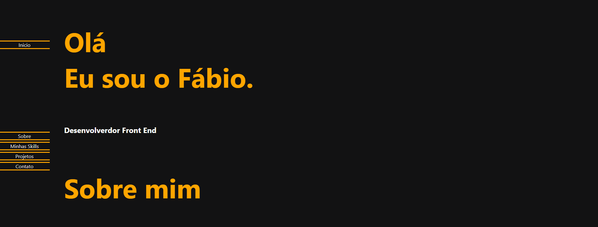

# Portifólio com React e TypeScript

Link para aceso na web (deploy): https://meu-repositorio-chi-gilt.vercel.app/

# Como surgiu a ideia do projeto?

Surgiu da necessidade de eu treinar o TypeScript e também da necessidade da realização do meu portifolio profissional como desenvolvedor front-end.

## Sobre o projeto

Esse projeto simplesmente é um site que será o meu portifólio de projetos na minha jornada dev.
Este portifólio tambem me ajudou a desnvolver meu primeiro menu mobile e fazer ele aparecer em determinada resolução.
A responsividade desse projeto foi muito legal de fazer porque tive a ideia de faze-lá adicionando uma seção do código por vez, que serviu para eu descobrir as partes no projeto que estavam quebrando a responsividade e ajusta-la de acordo com cada seção.

### 01. Rodando o Projeto
Primeiramente va ao terminal do projeto e execute o comando "npm i" para instalar todas as dependencias de uma vez.
Para rodar o projeto, utilize o comando "npm start" no terminal.

### 02. Dependencias/bibliotecas utilizadas

Para instalar todas as dependencias, somente é necessário executar o comando "npm i" no teminal.
E para rodar o mesmo, deve ser utilizar o comando "npm start.

## Criado por

Criado por mim Fabio Diogo. 
